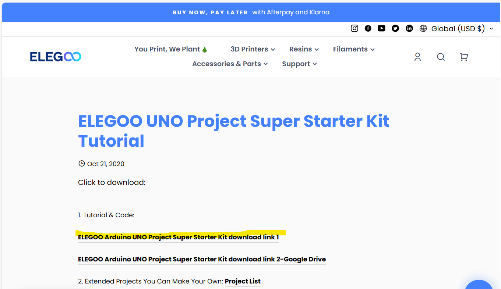
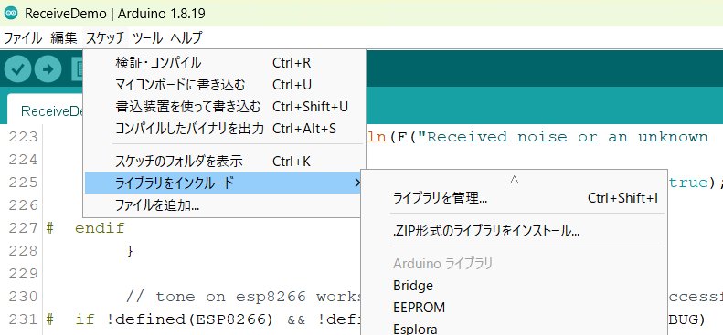
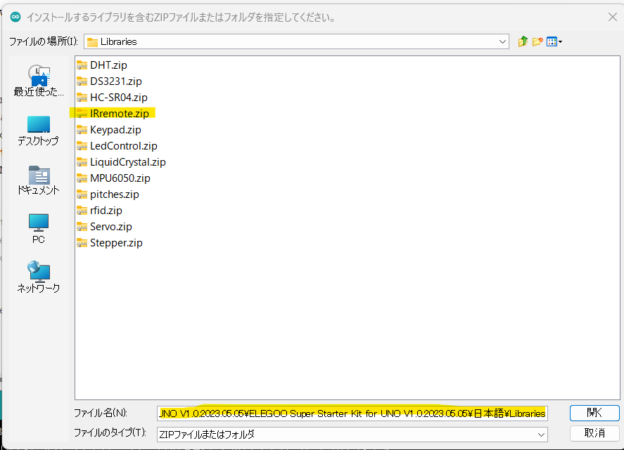
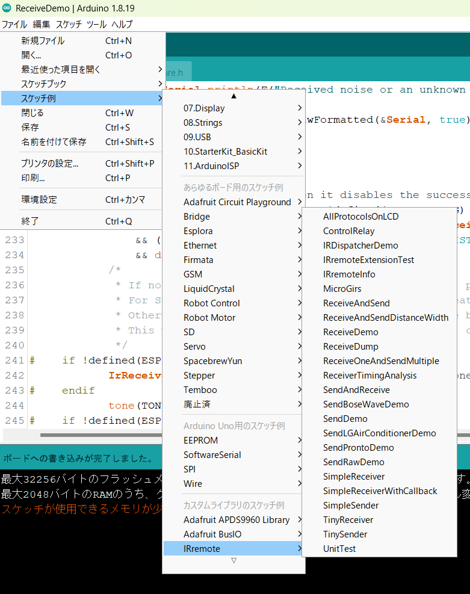

# ライブラリのインクルード方法
## Arduino IDE
1. ライブラリを[ダウンロード](https://www.elegoo.com/en-jp/blogs/arduino-projects/elegoo-uno-project-super-starter-kit-tutorial)し、解凍する

1. Arduino IDEを起動  

1. メニューの「スケッチ」→「ライブラリをインクルード」→「ZIP形式のライブラリをインストール」を選択

1. ダイアログが開くので、ダウンロードしたライブラリのZIPファイルを選択

1. ライブラリがインストールされる
1. メニューの「ファイル」→「スケッチ例」にライブラリが追加されているので、選択して開く

