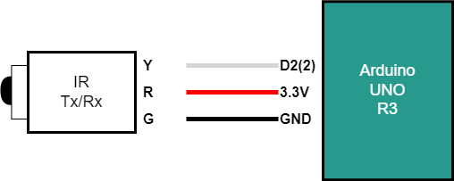
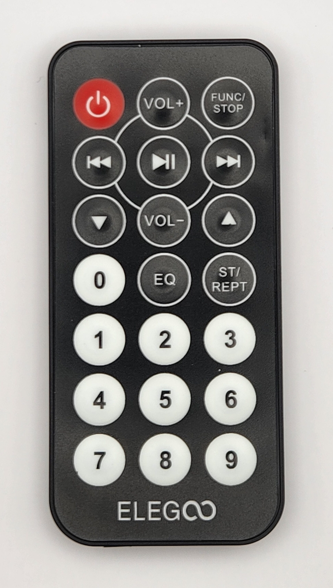
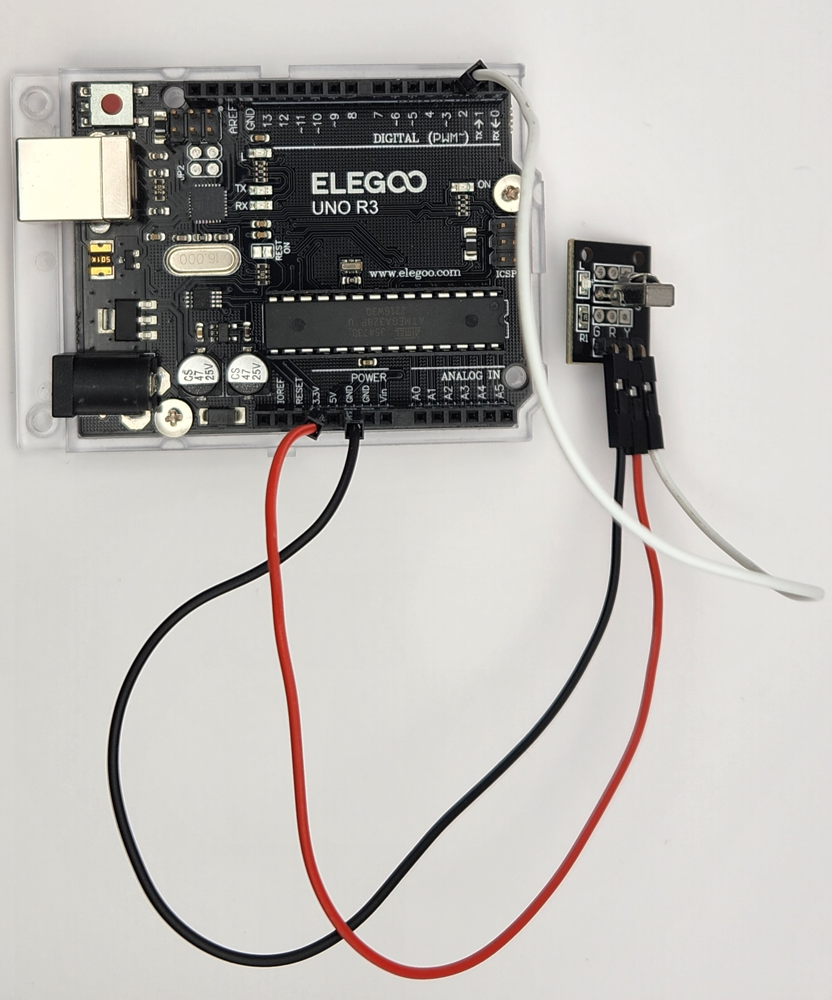

# Example codes for ELEGOO UNO R3 Project Super Starter Kit

## Project 1: JoyStick
### circuit

### photos

### reference
[link to code](./joy-stick.ino)

## Project 2: Ultrasonic Sensor
### circuit

### photos

### reference
[link to code](./ultra-sonic.ino)

## Project 3: Servo
### circuit

### photos

### reference
[link to code](./servo.ino)

## Project 4: Remote Controler
## circuit

## photos

## reference
how to include library in arduino -> [link to detail](./include-lib.md)
[link to code](./remote-controller.ino)